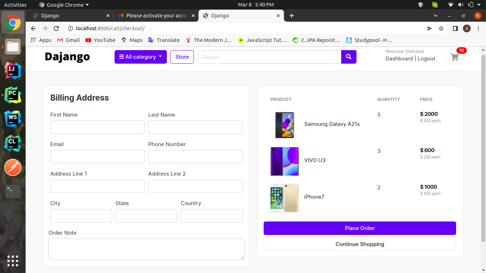
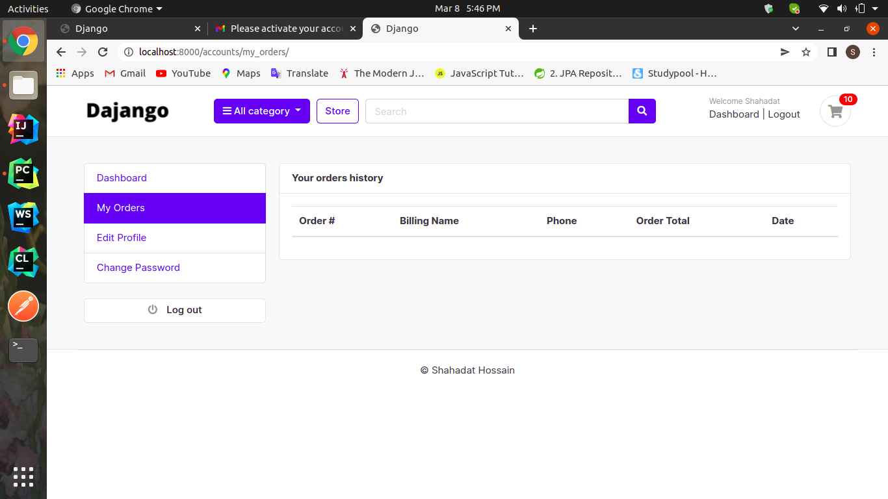

## Django e-Commerce Project

### Home Page

### Product Details and Add Product to cart

### Product add to cart

### Product Increase Decrease and change price

### Product list and price list and total price on cart and checkout

### Out of stock

### For checkout need to login

### User Registration form if have no account

### Verification link send to Email

### Verifications link in Email

### Click link and active account

### Billing Address Form

### Place Orders Details

### Pagination

### Product Search

### User Dashboard

### Order History

### Edit Profile

### Change Password

### Forgot Email Form

### Password Reset Link to email

### Reset New Password Update

### Admin Panel

